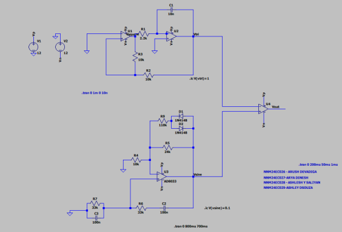
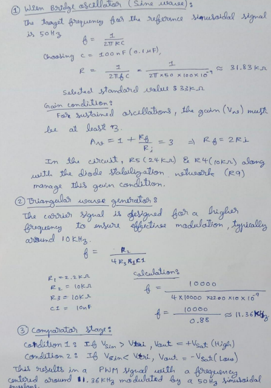

# Analog SPWM Generator using Op-Amps

Fully analog implementation of **Sinusoidal Pulse Width Modulation (SPWM)** using operational amplifiers — designed, simulated in **LTspice**, and validated through real hardware measurements.

---

## Output (Hardware Verified)

> Hardware-verified SPWM output showing duty cycle modulation with sinusoidal reference.

---

## Overview

This project demonstrates SPWM generation using purely analog circuits, without any microcontrollers or digital control.

A low-frequency sinusoidal reference signal is compared with a high-frequency triangular carrier to generate a PWM signal whose duty cycle follows the instantaneous amplitude of the sine wave.

This technique is fundamental in **Power Electronics**, with applications in:

- Power Inverters  
- Motor Drives  
- Class-D Audio Amplifiers  

---

## System Architecture

### Functional Blocks

- **Wien Bridge Oscillator**
  - Generates stable **50 Hz sine wave**
  - Diode-based stabilization maintains constant amplitude  

- **Triangular Wave Generator**
  - Implemented using **integrator + Schmitt trigger**
  - Produces **~10 kHz carrier waveform**

- **Comparator**
  - Compares sine and triangular signals  
  - Generates SPWM output  

---

## Working Principle

- If \( V_{sine} > V_{tri} \) → Output HIGH  
- If \( V_{sine} < V_{tri} \) → Output LOW  

This produces PWM where:

- Duty cycle varies with sine amplitude  
- Wide pulses near sine peaks  
- Narrow pulses near zero crossings  

---

## Simulation (LTspice)

### Circuit Schematic

> LTspice schematic showing Wien Bridge oscillator, triangular generator, and comparator stages.

### Waveform Output

### Verification

- Sine wave generation (~50 Hz)  
- Carrier waveform (~10 kHz design target)  
- SPWM duty cycle modulation  

👉 [Open LTspice Simulation File](simulation/spwm_generator.asc)

---

## Hardware Implementation

- Implemented on **zero PCB**
- Op-Amps used: **LM741 / LM324**
- Power Supply: **±12V / ±15V dual rail**
- Output verified using **Digital Storage Oscilloscope (DSO)**  

---

## Results

- Stable SPWM waveform successfully generated  
- Duty cycle accurately follows sinusoidal envelope  
- Carrier frequency observed in **~5–10 kHz range**  
- Strong agreement between:
  - Theoretical design  
  - LTspice simulation  
  - Hardware output  

> The observed deviation between calculated and measured frequencies highlights practical analog design limitations such as op-amp bandwidth constraints and component tolerances.

---

## Design Snapshot (Key Calculations)

- Wien Bridge Oscillator:
  - \( f = \frac{1}{2\pi RC} \)
  - Designed for **50 Hz sine wave**

- Triangular Wave Generator:
  - Target: **~10 kHz carrier**
  - Calculated: ~11.36 kHz  
  - Observed: ~5–10 kHz  

- Comparator:
  - \( V_{sine} > V_{tri} \) → HIGH  
  - \( V_{sine} < V_{tri} \) → LOW  

📄 Full derivations:  
👉 [View Detailed Calculations](calculations/design_calculations.md)

---

## Handwritten Calculations (Original Work)

> Initial design calculations were performed manually before simulation and hardware implementation.

---

## Documentation

📄 Full project report (design methodology, calculations, simulation, and hardware validation):

👉 [Download Report (PDF)](docs/spwm_report.pdf)

---

## Applications

- DC-AC Power Inverters  
- Variable Frequency Motor Drives  
- Class-D Audio Amplifiers  
- Analog Modulation Systems  

---

## Key Learnings

- Analog circuits require precise **stability and gain control**  
- Component tolerances significantly affect frequency accuracy  
- Diode-based stabilization is critical in oscillator design  
- Analog SPWM reveals real-world non-idealities often abstracted in digital systems  

---

## Future Improvements

- Use high-speed / precision op-amps  
- Add low-pass filtering for waveform reconstruction  
- Integrate with inverter stage  
- Optimize PCB layout to reduce noise  

---

## Repository Structure

/simulation → LTspice files and simulation data
/hardware → PCB implementation images
/images → Waveforms, diagrams, schematics
/docs → Project report
/calculations → Design calculations (clean + handwritten)

---

## Author

**Arya Dinesh**  
B.Tech Electronics & Communication Engineering

📫 *Let’s connect:* www.linkedin.com/in/aryadinesh2005 

---

⭐ *If you found this project interesting, feel free to star this repository!*  
🧠 *Open for collaboration or discussion on FPGA, digital design, and embedded systems.*

---

