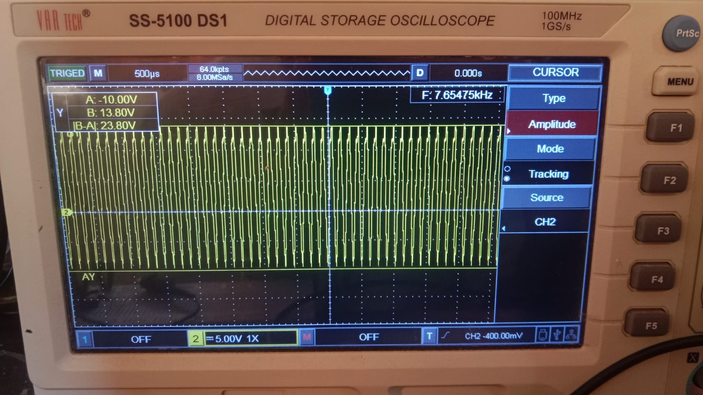
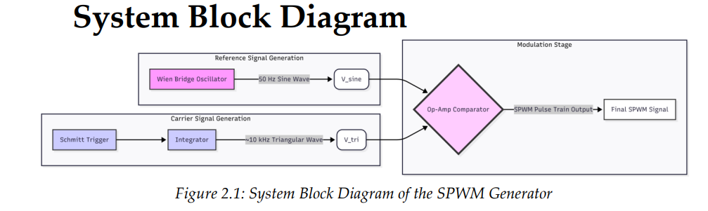
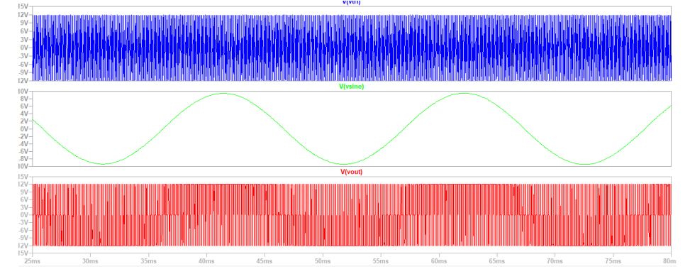

# Analog SPWM Generator using Op-Amps

Design, simulation, and hardware implementation of a Sinusoidal PWM (SPWM) generator using analog operational amplifiers.

---

## Output (Hardware Verified)

---

## Overview

This project implements SPWM using purely analog circuits.

Instead of using microcontrollers, the system generates PWM by comparing a sinusoidal reference with a high-frequency triangular carrier.

PWM signals are widely used in power electronics for controlling power delivery and waveform synthesis.

---

## System Architecture

### Functional Blocks

1. **Wien Bridge Oscillator**
   - Generates 50 Hz sine wave
   - Uses diode stabilization for amplitude control

2. **Triangular Wave Generator**
   - Integrator + Schmitt trigger
   - Produces ~10 kHz carrier

3. **Comparator**
   - Compares sine and triangular wave
   - Outputs SPWM signal

---

## Working Principle

- If Vsine > Vtri → Output HIGH  
- If Vsine < Vtri → Output LOW  

This produces PWM where:
- Duty cycle follows sine amplitude  
- Wide pulses at peaks  
- Narrow pulses near zero crossings  

---

## Simulation (LTspice)

- Circuit designed and verified in LTspice  
- Verified:
  - Sine wave generation (~50 Hz)
  - Carrier waveform (~10 kHz design target)
  - SPWM waveform behavior  

Simulation file:

simulation/spwm_generator.asc

---

## Hardware Implementation

- Implemented on zero PCB  
- Op-amps: LM741 / LM324  
- Power supply: ±12V / ±15V  
- Output verified using Digital Storage Oscilloscope (DSO)

---

## Results

- Stable SPWM waveform observed  
- Duty cycle varies according to sinusoidal envelope  
- Carrier frequency ≈ 5–10 kHz (variation due to component tolerances)  
- Strong agreement between:
  - Theoretical design  
  - Simulation  
  - Hardware output  

---

## Design Calculations

See:

/calculations/design_calculations.md

---

## Applications

- Power inverters  
- Motor drives  
- Class-D amplifiers  

---

## Key Learnings

- Analog circuits require precise stability control  
- Component tolerances significantly affect frequency  
- Diode-based stabilization is essential in oscillator design  
- Analog SPWM reveals non-ideal circuit behavior  

---

## Future Improvements

- Use high-speed op-amps for improved switching performance  
- Add low-pass filtering for waveform reconstruction  
- Integrate with inverter stage  
- Improve PCB layout to reduce noise  

---

## Repository Structure

/simulation
/hardware
/images
/docs
/calculations

---

## References

- Sedra & Smith, *Microelectronic Circuits*  
- Boylestad & Nashelsky, *Electronic Devices and Circuit Theory*  
- Texas Instruments, PWM and analog design application notes  

---

## Author

Arya Dinesh  
B.Tech Electronics & Communication Engineering
